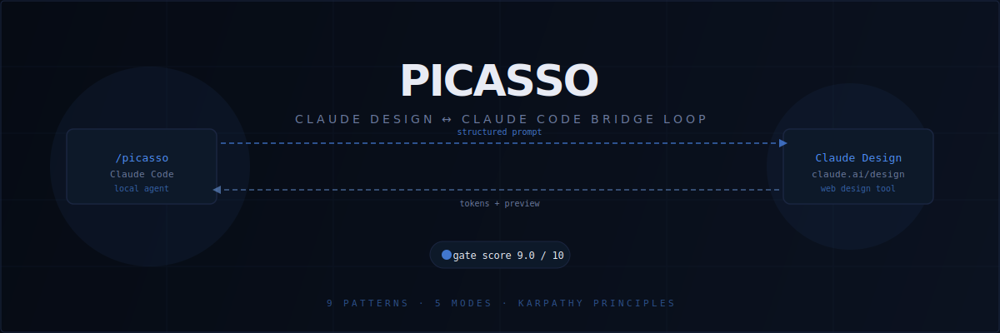

<div align="center">



<br/><br/>

[](https://github.com/RazvanGabrielNiculae/picasso-claude-design-claude-code-bridge-loop)
[](https://RazvanGabrielNiculae.github.io/picasso-claude-design-claude-code-bridge-loop/)

<br/>

[](https://github.com/RazvanGabrielNiculae/picasso-claude-design-claude-code-bridge-loop/stargazers)
[](docs/GATE-SCORING.md)
[](docs/DESIGN-PATTERNS.md)
[](LICENSE)

<br/>

[](https://claude.ai/code)
[](https://claude.ai/design)
[](docs/DESIGN-PATTERNS.md)
[](docs/MODES.md)

</div>

---

A bidirectional loop between **Claude Code** (local coding agent) and **Claude Design** (`claude.ai/design`). Send a structured brief, receive a design, implement it locally, score fidelity automatically, refine, and repeat until a quality gate is hit.

```
 ┌───────────────────┐    structured prompt    ┌──────────────────────┐
 │ /picasso          │ ──────────────────────► │ Claude Design        │
 │ (Claude Code)     │                          │ (claude.ai/design)   │
 │                   │ ◄────────────────────── │                      │
 └───────────────────┘    tokens + preview      └──────────────────────┘
         │                                               ▲
         │ implement · render · score                    │
         ▼                                               │
  impl preview ──► ΔE / layout / motion ──► gap refine loop
```

## What you get

- **`/picasso`** — creative front-end orchestrator command for Claude Code
- **`/picasso --design-loop`** — activates the bidirectional PDL (Picasso Design Loop)
- **`pdl-conductor`** — dedicated agent: manages rounds, scoring, gate enforcement
- **`pdl-autodetect` hook** — auto-detects a Claude Design handoff and suggests the loop
- Installers for macOS / Linux / WSL / Git-Bash and Windows PowerShell

## Status

Research / early preview. The design loop requires a **Claude Pro / Max / Team / Enterprise** account (Claude Design is a research preview restricted to those plans).

## Prerequisites

| Tool | Why | Link |
|---|---|---|
| Claude Code | Host for `/picasso` | https://claude.ai/code |
| Chrome MCP | Browser automation for claude.ai/design | https://claude.ai/chrome |
| webdesign-mcp | Token extraction + preview render + scoring | https://github.com/Bendix-ai/webdesign-mcp |
| Claude Pro / Max / Team / Enterprise | Access to Claude Design | https://claude.com/pricing |

## Install

### One-liner (macOS / Linux / WSL / Git-Bash)

```bash
curl -fsSL https://cdn.jsdelivr.net/gh/RazvanGabrielNiculae/picasso-claude-design-claude-code-bridge-loop@main/scripts/install-oneliner.sh | bash
```

Interactive wizard (asks for gate, rounds, hook auto-wiring):

```bash
curl -fsSL https://cdn.jsdelivr.net/gh/RazvanGabrielNiculae/picasso-claude-design-claude-code-bridge-loop@main/scripts/install-oneliner.sh | bash -s -- --wizard
```

### Manual clone

```bash
git clone https://github.com/RazvanGabrielNiculae/picasso-claude-design-claude-code-bridge-loop.git
cd picasso-claude-design-claude-code-bridge-loop
bash scripts/install.sh --wizard
bash scripts/verify.sh --smoke
```

### Windows (PowerShell)

```powershell
git clone https://github.com/RazvanGabrielNiculae/picasso-claude-design-claude-code-bridge-loop.git
cd picasso-claude-design-claude-code-bridge-loop
pwsh -File scripts\install.ps1
pwsh -File scripts\verify.ps1
```

## Use

```bash
# Bridge loop — Claude Code ↔ Claude Design, gate 9.0, max 6 rounds
/picasso --design-loop hero cinematic for a B2B SaaS, dark elite

# One-shot: single Claude Design pass → code, no iteration
/picasso --design-solo sticky promo banner, warm palette

# Critique: Claude Design audits an existing implementation
/picasso --design-critique ./src/components/hero

# Reference: reverse-engineer tokens from a real site, then brief
/picasso --design-reference https://linear.app

# Iterate: polish pass after an earlier APPROVED loop
/picasso --design-iterate tighten motion choreography

# Scope presets
/picasso --scope simple  "pricing toggle"           # gate 8.0, 3 rounds
/picasso --scope medium  "pricing page section"     # gate 8.5, 5 rounds
/picasso --scope complex "full marketing landing"   # gate 9.0, 7 rounds
/picasso --scope mega    "marketing site (5 pages)" # gate 9.0, 10 rounds
```

## Scoring

| Criterion | Weight | Method |
|---|---|---|
| Colors | 25% | Dominant palette + ΔE CIE2000 per token |
| Typography | 20% | Family / scale / weight / line-height |
| Layout & spacing | 20% | Grid + margins (±2px tolerance) |
| Components | 15% | Structural match |
| Motion | 10% | Duration / easing / transitions |
| Responsive | 10% | 8 breakpoints |

Default gate: **9.0 / 10**. Raise to 9.5 for critical landings (higher stagnation risk).

## Lifecycle hooks

The installer drops optional stubs into `~/.claude/hooks/`:

| Hook | Trigger |
|---|---|
| `pdl-pre-round.sh` | Before every round |
| `pdl-post-round.sh` | After scoring (can force APPROVED or abort) |
| `pdl-stagnation.sh` | When scores oscillate |
| `pdl-approved.sh` | On success — auto-commit, open PR, notify |
| `pdl-failed.sh` | On exhaustion / block / error |

Edit a stub to activate it, or delete it to disable. See [docs/HOOKS.md](docs/HOOKS.md).

## Docs

| | |
|---|---|
| [Architecture](docs/ARCHITECTURE.md) | System overview and component map |
| [Bridge loop walkthrough](docs/BRIDGE-LOOP.md) | Phase-by-phase loop execution |
| [Modes & scope presets](docs/MODES.md) | 5 loop variants explained |
| [Gate scoring](docs/GATE-SCORING.md) | Weighted criteria + tuning guide |
| [Design patterns](docs/DESIGN-PATTERNS.md) | 9 orchestration patterns + Karpathy principles |
| [Token optimization](docs/TOKEN-OPTIMIZATION.md) | 3× overhead reduction techniques |
| [Lifecycle hooks](docs/HOOKS.md) | Hook system reference |
| [Prompt templates](docs/PROMPT-TEMPLATES.md) | Round-0 and Round-N formats |
| [Installation](docs/INSTALLATION.md) | Full install guide |
| [Troubleshooting](docs/TROUBLESHOOTING.md) | Common issues + fixes |

## Uninstall

```bash
bash scripts/uninstall.sh
```

Then remove the hook block from `~/.claude/settings.json` manually.

## License

MIT — see [LICENSE](LICENSE).

---

<div align="center">
<sub>Not affiliated with Anthropic. "Claude", "Claude Code", and "Claude Design" are trademarks of Anthropic.<br/>This project only orchestrates user-owned sessions of those tools.</sub>
</div>
